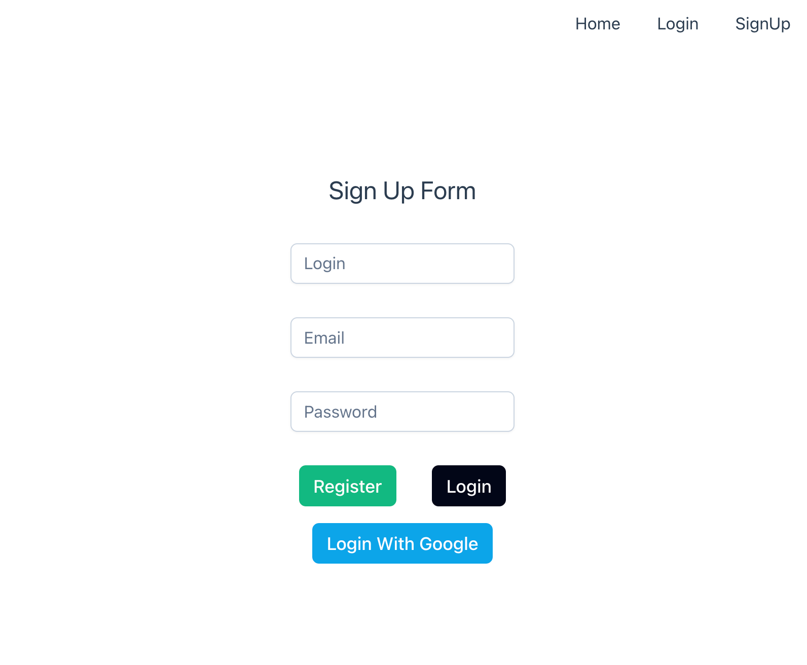

<h1 align="center">
    <br>
    
    <br>
    Golang + SQLite + VueJs from the one binary!
    <br>
</h1>

<h4 align="center">Golang boilerplate project to have a quick setup of server with JWT Authentication and usage of
    SQLlite with ready to use frontend. FE app starts from the same binary.</h4>

<p align="center">
    <a href="#key-features">Key Features</a> •
    <a href="#how-to-use">How to use?</a> •
    <a href="#how-to-auth">How Authorisation works?</a> •
    <a href="#api">Api</a> •
    <a href="#license">License</a>
</p>

## Key Features

* SQLite DB instance prepared - easy to create needed structures with goose library.
* VueJS simple app ready to use - starts from the same binary.
* Logs of information from the request/response.
* PII - simple example to parse body in logger middleware and hide personal ident. information (password).
* Fiber framework - fast golang web library.
* SignUp - prepared endpoint to register the user.
* SignIn - authenticate user and get access & refresh tokens.
* OAuth2.0 - authenticate user and get access & refresh tokens by 3rd parties (as an example with Google)
* Refresh - refresh tokens.
* Easy-to-test - project structured in a way to make it simple and easy to mock everything and test.

## How To Use

Just build and run! And get ready lightweight FE+BE+DB!

```sh
make build

./golite
```

Go the the `http://localhost:5173/`
There you can create user and login.

<br>

<br>

## How Authorisation works?

JWT auth with login and password
```
+--------+                                           +---------------+
|        |--(A)------- Authorization Grant --------->|               |
|        |                                           |               |
|        |<-(B)----------- Access Token -------------|               |
|        |               & Refresh Token             |               |
|        |                                           |               |
|        |                                           |               |
|        |--(C)----------- Access Token ------------>|               |
|        |                                           |               |
|        |<-(D)--------- Protected Resource ---------| Authorization |
| Client |                                           |     Server    |
|        |--(E)----------- Access Token ------------>|               |
|        |                                           |               |
|        |<-(F)-------- Invalid Token Error ---------|               |
|        |                                           |               |
|        |                                           |               |
|        |--(G)----------- Refresh Token ----------->|               |
|        |                                           |               |
|        |<-(H)----------- Access Token -------------|               |
+--------+           & Optional Refresh Token        +---------------+
```

Login with OAuth 2.0 (Google example)
```
+-------+                                +--------+                               +------+
|       |--(1)---- Log in with Google -->|        |                               |      |
|       |                                |        |                               |      |
|  User |<-(2)- Redirect to Google Auth--|  Go    |                               |Google|
|       |                                |  App   |                               |OAuth2|
|       |--(3)----- Auth Code ---------->|        |                               |Server|
|       |                                |        |--(4)-- Exchange Auth Code --->|      |
|       |                                |        |<-(5)---- Access Token --------|      |
|       |                                |        |                               |      |
|       |                                |        |--(6)--- Request User Info --->|      |
|       |                                |        |<-(7)-- User Info Response ----|      |
|       |<-(8)-- Generated JWT Tokens ---|        |                               |      |
+-------+                                +--------+                               +------+
```

Environment variables
```
# App configs
# App configs
APPLICATION_NAME=my_app
SERVER_PORT=4000

# DB configs
DB_FOLDER=
DB_NAME=golite
DB_MAX_IDLE_CONNS=50
DB_MAX_OPEN_CONNS=120
DB_LOG_LEVEL=error

# JWT configs
JWT_SECRET_KEY=test
JWT_ACCESS_TOKEN_HOURS=1
JWT_REFRESH_TOKEN_HOURS=24

# Google auth configs
GOOGLE_CLIENT_ID=client_id
GOOGLE_CLIENT_SECRET=client_secret
GOOGLE_CALLBACK_URL=http://localhost:4000/api/v1/oauth2/google/callback

#Client API
CLIENT_OAUTH2_CALLBACK_URL=http://localhost:5173/api/v1/oauth2/callback

# UI
VITE_SERVER_HOST=http://localhost:4000
```

```bash
# Clone this repository
$ git clone https://github.com/antlko/golite.git

# Go into the repository
$ cd goauth-boilerplate

# Copy default envs and change .env as you want
$ cp .env.dist .env

# Deploy postgres container on demand
$ docker-compose up -d

# Run the app
$ go run main.go
```

## Api

Endpoints for auth. by Login and Password
```http
POST /api/v1/auth/signup
{
"login":"test",
"email":"test@gmail.com",
"password":"test"
}

POST /api/v1/auth/signin
{
"login":"test",
"password":"test"
}
```

Endpoint to refresh access token
```http
POST /api/v1/auth/token/refresh
{
"refresh_token":"your_refresh_token"
}
```

Endpoints to login with google
```http
POST /api/v1/oauth2/google/signin
GET /api/v1/oauth2/google/callback
```

Example of usage the protected endpoint
```http
GET /api/v1/protected/user
Authorization: Bearer your_access_token
```

## License

MIT